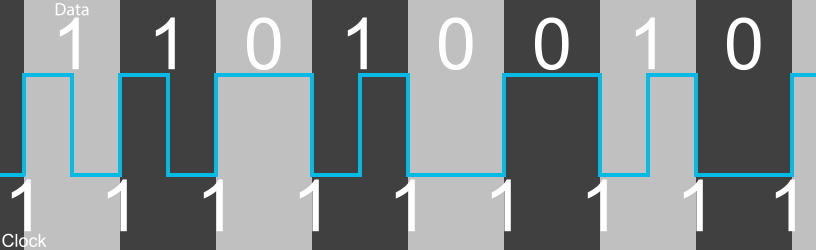

# FM Encoding

FM, or Frequency Encoding, is a method of storing information on magnetic media

Information is stored on magnetic media using changes in the polarity of the magnetic substance, these are known as flux transitions.
A flux transition encodes a binary 1 while a 0 is encoded by the lack of a flux transition.

FM Encoding inserts a flux transition as a clock bit between each data bit. This allows for easy timing synchronization but limits the 
amount of information that can be stored because there is a physical limit for how close two flux transitions can be to
each other.

## Example

For an example lets consider the byte 11010010. To encode this we simply insert a 1 clock bit between each data bit

| Data | | 1| | 1| | 0| | 1| | 0| | 0| | 1| | 0 | |
| --- | :---: | :---: | :---: | :---: | :---: | :---: | :---: | :---: | :---: | :---: | :---: | :---: | :---: | :---: | :---: | :---: | :---: |
| Clock | 1 | | 1 | | 1 | | 1 | | 1 | | 1 | | 1 | | 1 |  | 1 |
| Result | 1 | **1** | 1 | **1** | 1 | **0** | 1 | **1** | 1 | **0** | 1 | **0** | 1 | **1** | 1 | **0** | 1 |

The following diagram shows how this data would be recorded on a magnetic medium

The dark grey squares are the clock bits and the light grey squares are the data bits. There is a clock bit before and after each data bit.
The sections are known as bitcells. The blue line indicates the polarity of the magnetic substance as the information is read. The starting
position is irrelevant as information is encoded using the change in polarity. For cells containing a 1 the line goes from near the bottom
to near the top or from near the top to near the bottom to indicate that a change in polarity and therefore a flux transition has occurred. 
For cells containing a 0 the line stays at the same level to indicate that no change in polarity and therefore no flux transition has occurred.

The bitcells are as follows

* Clock bit, 1, polarity changes
* Data bit, 1, polarity changes
* Clock bit, 1, polarity changes
* Data bit, 1, polarity changes
* Clock bit, 1, polarity changes
* Data bit, 0, no polarity change
* Clock bit, 1, polarity changes
* Data bit, 1, polarity changes
* Clock bit, 1, polarity changes
* Data bit, 0, no polarity change
* Clock bit, 1, polarity changes
* Data bit, 0, no polarity change
* Clock bit, 1, polarity changes
* Data bit, 1, polarity changes
* Clock bit, 1, polarity changes
* Data bit, 0, no polarity change
* Clock bit, 1, polarity changes

Note that because of the clock bits, most bitcells contain a 1 and that there are long stretches of 1s but never more than one 0 in a row.
This makes the clock synchronization easy as a flux transition occurs every bitcell or every other bitcell. The problem is that the
amount of data is limited by how close flux transitions can be to each other.

## Disk Layout