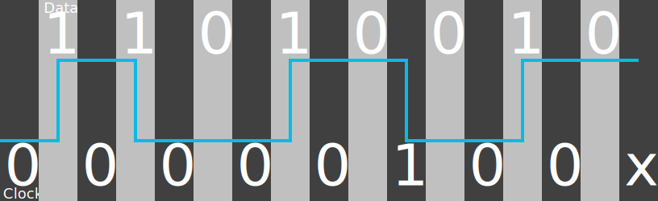
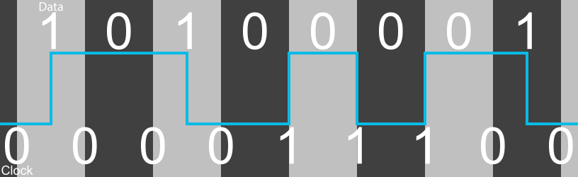
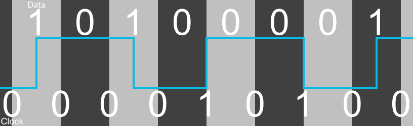

# MFM Encoding

MFM, or Modified Frequency Modulation Encoding, as the name implies is a modification of the earlier [Frequency Modulation (FM) encoding][docs-fm]

MFM Encoding tries to improve the information density by not allowing two flux transitions, changes in polarity, to occur in sequence. This is done by suppressing
the clock bit if it is adjacent to a 1 data bit. This has the benefit of allowing twice as much information to be stored because the length
between any two flux transitions is doubled but at the cost of increasing the complexity of timing synchronization because there is no
longer a consistent clock pulse

This makes each bitcell, the space between one possible clock transition and then next, half the length as they would be with FM encoding.

The rules for clock bits then become
* A 1 data bit will have a 0 clock bit before and after it
* A series of two or more 0 data bits will have 1 clock bits between them

## Example

For an example lets consider the byte 11010010. To encode this we insert a 0 clock bit around each 1 data bit and a 1 between repeated
0 data bits.

| Data   |   |   1   |   |   1   |   |   0   |   |   1   |   |   0   |   |   0   |   |   1   |   |   0   |   |
| ---    | :---: | :---: | :---: | :---: | :---: | :---: | :---: | :---: | :---: | :---: | :---: | :---: | :---: | :---: | :---: | :---: | :---: |
| Clock  | 0 |       | 0 |       | 0 |       | 0 |       | 0 |       | 1 |       | 0 |       | 0 |       | x |
| Result | 0 | **1** | 0 | **1** | 0 | **0** | 0 | **1** | 0 | **0** | 1 | **0** | 0 | **1** | 0 | **0** | x |

We don't know what the last clock bit is because it depends on what the next data bit is. If the next bit is a 0 then the clock bit would
be a 1, if the next bit is a 1 then the clock bit would be a 0.

The following diagram shows how this data would be recorded on a magnetic medium



The bitcells are represented by the alternating light and dark grey backgrounds. The values of the data bits are along the top and the
value of the clock bits are allow the bottom. The blue line going along the diagram represents the polarity of the magnetic substance.
It has two states, near the top and near the bottom. A flux transition is represented by the line going from one position to the other
and then continuing on from there. 

From left to right we have

* Clock bit, 0, no polarity change
* Data bit, 1, polarity changes
* Clock bit, 0, no polarity change
* Data bit, 1, polarity changes
* Clock bit, 0, no polarity change
* Data bit, 0, no polarity change
* Clock bit, 0, no polarity change
* Data bit, 1, polarity changes
* Clock bit, 0, no polarity change
* Data bit, 0, no polarity change
* Clock bit, 1, polarity changes
* Data bit, 0, no polarity change
* Clock bit, 0, no polarity change
* Data bit, 1, polarity changes
* Clock bit, 0, no polarity change
* Data bit, 0, no polarity change
* Clock bit, unknown

The minimum number of 0s in a row is one and the maximum is three because of this MFM Encoding is also known as Group coded recording, GCR, (1,3) with the 1 representing
the minimum number of 0s and the 3 representing the maximum number of 0s.

For MFM Encoding the bitcell length must be at least the minimum flux transition spacing as it's possible to have a flux transition
in the center of two adjacent bitcells or on both boundaries of a bitcell. 

There can be one and a half bitcells between flux transitions when starting or ending a series of 0 data bits and two bitcells between
flux transitions if a 0 data bit appears between two 1 data bits.

## Timing

Timing is the main challenge when it comes to decoding data stored on a magnetic medium. Knowing when a 1 occurs is trivial because there will
always be an accompanying flux transition but determining how many 0s are between those flux transitions can be difficult especially
as no two systems have perfectly identical clock rates.

The various Floppy Disk standards that use MFM for encoding specify the range of bitcell lengths for the various bit sequences.

| Sequence | Number of 0s | Percentage of Bitcell length |
| --- | --- | --- |
| 1 1 data bits with a 0 clock bit between them or 0 0 0 data bits with 1 clock bits between them | 1 | 80 - 120% |
| 1 0 data bits with a 0 clock bit between them or 0 1 data bits with a 0 clock bit between them | 2 | 130 - 165 % |
| 1 0 1 data bits with 0 clock bits between them | 3 | 185 - 225% |

We can also determine the expected bitcell length based on the standards which include the nominal bitcell length in microradians and the
speed of rotation in rotations per minute

Rotation Speed in radians/second = (Rotation Speed in revolutions/minute x 2π radians/revolution) / 60 seconds/minute

Bitcell Length in radians = Bitcell Length in microradians x 10<sup>−6</sup> radians / microradians

Bitcell Length in seconds = Bitcell Length in radians / Rotation Speed in radians/second

| Disk Type | Rotation Speed (RPM) | Rotation Speed (rad/s) | bitcell length (μrad) | bitcell length (rad) | Bitcell length (s) |
| --- | ---: |  ---: |  ---: | ---: | ---: |
| 5.25" DS-DD 360k | 300 | 31.416 | 125.7 | 0.0001257 | 4.00116 x 10<sup>−6</sup> |
| 5.25" DS-HD 1200k | 360 | 37.699 | 75.5 | 0.0000755 | 2.0027 x 10<sup>−6</sup>  |
| 3.5" DS-DD 720k | 300 | 31.416 | 125.7 | 0.0001257 | 4.00116 x 10<sup>−6</sup> |
| 3.5" DS-HD 1440k | 300 | 31.416 | 62.8 | 0.0000628 | 1.99899 x 10<sup>−6</sup> |

But this is just the expected bitcell length, the actually length encountered on a disk may very. To handle this, floppy controllers need
to try and figure out what the encoded bitcell length is. They do this with a feedback mechanism known as Phase-locked loop or PLL.
Basically the controller compares the expected bitcell length against the actual bitcell length it is seeing on the disk and adjusts
the expected bitcell length towards the actual bitcell length by some fraction of the difference. The idea is that eventually the two
will lock on and keep the expected bitcell length consistent with what is being read.

Note that in actual floppy controllers the PLL logic is actually applied to the frequency being used to decode data and not the
bitcell length but the affect is the same.

## Disk Layout

Floppy Disks have data encoded onto 40 or 80 tracks depending on the disk type. Only parts of the track are actually used for data, the
rest are used for metadata and gaps.

The layout of a track is as follows

| Section | Description |
| --- | --- |
| Index Gap | 32 to 146 bytes of unspecified data (Cannot contain the identifier mark) |
| Sector Identifier | Includes sector information for the next data block |
| Identifier Gap | 22 0x4E bytes |
| Data Block | The sector data |
| Data Block Gap | 101 0x4E bytes |
| ... | A track will contain several sectors each with their own Sector Identifier, Identifier Gap, Data Block and Data Block Gap |
| Track Gap | A series of 0x4E bytes until the index occurs |

### Sector Identifier

The sector identifier contains information about the sector as follows

| Part | Description |
| --- | --- |
| Identifier Mark | 12 0x00 bytes, 3 0xA1 bytes with a missing clock pulse as described later, 0xFE |
| Cylinder/Track Number | 1 byte, starting from 0x00 |
| Side Number | 1 byte, 0x00 or 0x01 |
| Sector Number | 1 byte, starting from 0x01 |
| Sector Size | 1 byte, typically 0x02, see below |
| Error Detection Characters | 2 byte, generated starting from the A1 bytes and ending with the sector size |

#### Identifier Mark

After a series of null bytes the Identifier mark has 3 A1 bytes that are missing a clock pulse.

Normally A1 would be encoded as such

| Data   |   |   1   |   |   0   |   |   1   |   |   0   |   |   0   |   |   0   |   |   0   |   |   1   |   |
| ---    | :---: | :---: | :---: | :---: | :---: | :---: | :---: | :---: | :---: | :---: | :---: | :---: | :---: | :---: | :---: | :---: | :---: |
| Clock  | 0 |       | 0 |       | 0 |       | 0 |       | 1 |       | 1 |       | 1 |       | 0 |       | 0 |
| Result | 0 | **1** | 0 | **0** | 0 | **1** | 0 | **0** | 1 | **0** | 1 | **0** | 1 | **0** | 0 | **1** | 0 |

Or in diagram form



but for these Identifier marks they are encoded like this 

| Data   |   |   1   |   |   0   |   |   1   |   |   0   |   |   0   |   |   0   |   |   0   |   |   1   |   |
| ---    | :---: | :---: | :---: | :---: | :---: | :---: | :---: | :---: | :---: | :---: | :---: | :---: | :---: | :---: | :---: | :---: | :---: |
| Clock  | 0 |       | 0 |       | 0 |       | 0 |       | 1 |       | 0 |       | 1 |       | 0 |       | 0 |
| Result | 0 | **1** | 0 | **0** | 0 | **1** | 0 | **0** | 1 | **0** | 0 | **0** | 1 | **0** | 0 | **1** | 0 |

Or



There's a missing clock pulse between bit 3 and bit 4 (counting from bit 1 on the right). There should be a flux transition here because
it's encoding a series of 0 data bits but one is missing. This is used to tell the controller that an Identifier or Data block is coming
up and it also helps to make sure the controller knows which bits are data and which bits are the clock.

Note that it's these malformed A1 bytes that aren't allowed in the index gap as they could confuse the controller.

The FE byte indicates that this is the Sector Identifier.

#### Sector Size

This byte encodes the sector size as follows

| Value | Size |
| --- | --- |
| 0x00 | 128 bytes |
| 0x01 | 256 bytes |
| 0x02 | 512 bytes |
| 0x03 | 1024 bytes |

For PC disks this is typically 0x02 or 512 bytes

### Data Block

The Data Block contains the sector data as follows

| Part | Description |
| --- | --- |
| Data Mark | 12 0x00 bytes, 3 0xA1 bytes with a missing clock pulse as described earlier, 0xFB |
| Data | The sector data, the number of bytes is based on the size byte in the identifier but is typically 512 bytes |
| Error Detection Characters | 2 byte, generated starting from the A1 bytes and ending with the last data byte |

#### Identifier Mark

After a series of null bytes the Identifier mark has 3 A1 bytes that are missing a clock pulse like those in the Identifier mark.

The FB byte indicates that this is the Data Block.

## Error Correction

Both the Sector Identifier and Data Block contain Error Detection Characters, EDC, that help to detect errors.

These bytes are calculated by processing the information in the Sector Identifier or the Data Block and then get stored along with the bytes
of those structures so that they can be used to validate them.

These bytes are calculated using CRC-16/CCITT-FALSE, that is a 16-bit Cyclic redundancy check using the polynomial x<sup>16</sup> + x<sup>12</sup> + x<sup>5</sup> + 1
with an initial value of 0xFF (or all 1s).

This is typically implemented using shift register with feedback connections.

The 16-bit error correction register is initialized to 0xFF. The incoming bit is exclusive-ored (xor'd, true if both inputs are different) with the contents
of bit 15 (counting up from the least significant bit, bit 0). The result of this operation is xor'd with bit 4 and bit 11. All of the bits are shifted up 1 and the result of the first operation is
stored in bit 0. So the modified bit 4 becomes bit 5 and the modified bit 11 becomes bit 12.

For example, reading in the A1 byte from the identifier or data mark (01000100100010010)

We start with the EDC register = 0xFF
```
start - 1111 1111 1111 1111
```
The first bit (b0) read is a 0 and bit 15 (c15) is 1 so 1 xor 0 = 1
```
b0 = 0, c15 = 1
```
bit 11 (c11) = 1, 1 xor 1 = 0, bit 4 (c4) = 1, 1 xor 1 = 0
```
c11 = 0, c4 = 0, 
```
That gives us a value of
```
after = 1111 0111 1110 1111
        -    -       -
```
We then shift the value left to get
```
shift = 1110 1111 1101 1111
```
and then continue for the rest of the bits
```
b1 = 1, c15 = 0
c11 = 1, c4 = 1
after = 0110 1111 1101 1111
        -    -       -
shift = 1101 1111 1011 1110
b2 = 0, c15 = 1
c11 = 0, c4 = 0
after = 1101 0111 1010 1110
        -    -       -
shift = 1010 1111 0101 1101
b3 = 0, c15 = 1
c11 = 0, c4 = 0
after = 1010 0111 0100 1101
        -    -       -
shift = 0100 1110 1001 1011
b4 = 0, c15 = 0
c11 = 1, c4 = 1
after = 0100 1110 1001 1011
        -    -       -
shift = 1001 1101 0011 0110
b5 = 1, c15 = 0
c11 = 1, c4 = 1
after = 0001 1101 0011 0110
        -    -       -
shift = 0011 1010 0110 1100
b6 = 0, c15 = 0
c11 = 1, c4 = 0
after = 0011 1010 0110 1100
        -    -       -
shift = 0111 0100 1101 1000
b7 = 0, c15 = 0
c11 = 0, c4 = 1
after = 0111 0100 1101 1000
        -    -       -
shift = 1110 1001 1011 0000
b8 = 1, c15 = 0
c11 = 1, c4 = 1
after = 0110 1001 1011 0000
        -    -       -
shift = 1101 0011 0110 0000
b9 = 0, c15 = 1
c11 = 1, c4 = 1
after = 1101 1011 0111 0000
        -    -       -
shift = 1011 0110 1110 0001
b10 = 0, c15 = 1
c11 = 1, c4 = 1
after = 1011 1110 1111 0001
        -    -       -
shift = 0111 1101 1110 0011
b11 = 0, c15 = 0
c11 = 1, c4 = 0
after = 0111 1101 1110 0011
        -    -       -
shift = 1111 1011 1100 0110
b12 = 1, c15 = 0
c11 = 1, c4 = 0
after = 0111 1011 1100 0110
        -    -       -
shift = 1111 0111 1000 1100
b13 = 0, c15 = 1
c11 = 1, c4 = 1
after = 1111 1111 1001 1100
        -    -       -
shift = 1111 1111 0011 1001
b14 = 0, c15 = 1
c11 = 0, c4 = 0
after = 1111 0111 0010 1001
        -    -       -
shift = 1110 1110 0101 0011
b15 = 1, c15 = 0
c11 = 1, c4 = 1
after = 0110 1110 0101 0011
        -    -       -
shift = 1101 1100 1010 0110
b16 = 0, c15 = 1
c11 = 0, c4 = 1, 
after = 1101 0100 1011 0110
        -    -       -
shift = 1010 1001 0110 1101
```

And our result is 0xA96D

[docs-fm]: FM.md

