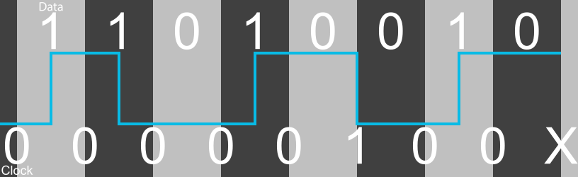

# MFM Encoding

MFM, or Modified Frequency Encoding, as the name implies is a modification of the earlier [FM encoding][docs-fm]

MFM Encoding tries to improve the information density by not allowing two flux transitions to occur in sequence. THis is done by suppressing
the clock bit if it is adjacent to a 1 bit. This has the benefit of allowing twice as much information to be stored because the length
between any two flux transitions is doubled but at the cost of increasing the complexity of timing synchronization because there is no
longer a consistent clock pulse

The rules for clock bits then become
* Every 1 data bit is surrounded by two 0 clock bits
* The data pattern 1 0 will have a 0 clock bit between then
* The data pattern 0 0 will have a 1 clock bit between then

## Example

For an example lets consider the byte 11010010. To encode this we simply insert a 1 clock bit between each data bit

| Data   |   |   1   |   |   1   |   |   0   |   |   1   |   |   0   |   |   0   |   |   1   |   |   0   |   |
| ---    | :---: | :---: | :---: | :---: | :---: | :---: | :---: | :---: | :---: | :---: | :---: | :---: | :---: | :---: | :---: | :---: | :---: |
| Clock  | 0 |       | 0 |       | 0 |       | 0 |       | 0 |       | 1 |       | 0 |       | 0 |       | x |
| Result | 0 | **1** | 0 | **1** | 0 | **0** | 0 | **1** | 0 | **0** | 1 | **0** | 0 | **1** | 0 | **0** | x |

The following diagram shows how this data would be recorded on a magnetic medium

The dark grey squares are the clock bits and the light grey squares are the data bits. There is a clock bit before and after each data bit.
The sections are known as bitcells. The blue line indicates the polarity of the magnetic substance as the information is read. The starting
position is irrelevant as information is encoded using the change in polarity. For cells containing a 1 the line goes from near the bottom
to near the top or from near the top to near the bottom to indicate that a change in polarity and therefore a flux transition has occurred. 
For cells containing a 0 the line stays at the same level to indicate that no change in polarity and therefore no flux transition has occurred.

The bitcells are as follows

* Clock bit, 0, no polarity change
* Data bit, 1, polarity changes
* Clock bit, 0, no polarity change
* Data bit, 1, polarity changes
* Clock bit, 0, no polarity change
* Data bit, 0, no polarity change
* Clock bit, 0, no polarity change
* Data bit, 1, polarity changes
* Clock bit, 0, no polarity change
* Data bit, 0, no polarity change
* Clock bit, 1, polarity changes
* Data bit, 0, no polarity change
* Clock bit, 0, no polarity change
* Data bit, 1, polarity changes
* Clock bit, 0, no polarity change
* Data bit, 0, no polarity change
* Clock bit, unknown

Note that with MFM most clock bits are 0s. This ensures that flux transitions are separated by at least 1 bitcell. Note also that
there are stretches of two or three 0s in a row. The density of flux transitions has gone down which allows for more information to
be stored by the lack of consistent clock pulses meant that synchronization is more complicated.

[docs-fm]: FM.md

